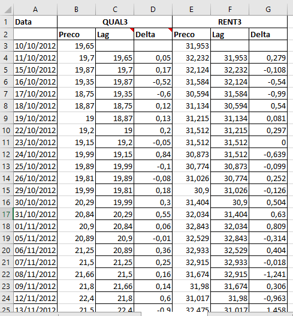

Este notebook tem o objetivo de reproduzir o passo-a-passo para detectar e avaliar pares de ativos [cointegrados](https://en.wikipedia.org/wiki/Cointegration) mostrado no [blog do Dr. Nickel](https://drnickel.wordpress.com/2015/04/03/long-short-atraves-de-cointegracao-parte-3/). 

No poste ele faz faz uma análise dos ativos QUAL3 e RENT3 usando uma [planilha excel](https://drnickel.files.wordpress.com/2015/04/exemplos-cointegracao-qual3_rent32.xlsx), neste notebook refaço o procedimento usando R.

## Dataset

Para garantir que os resultados batam, vamos usar os mesmos dados usado na planilha.




```{r loadData, message=FALSE, warning=FALSE}
# datahandlers
library(tidyverse)
library(lubridate)

# loading data
library(xlsx)
xls <- read.xlsx("./exemplos-cointegracao-qual3_rent32.xlsx",2) 

# the dataset read is a mess
glimpse(xls)
```

Vamos ajustar (tidying) o dataset para deixar como uma tabela: ticker, data, valor.

```{r tidyingTickers}
# cleaning up (tidying)
# separa os dados da QUAL3
xls %>% 
  as.tibble() %>% 
  select( ref.date = Data, price.close=QUAL3 ) %>% 
  filter( complete.cases(.) ) %>% 
  mutate( ticker="QUAL3.SA",
          price.close = as.numeric(as.character(price.close)) ) -> qual


# separa os dados da RENT3
xls %>% 
  as.tibble() %>% 
  select( ref.date = Data, price.close=RENT3 ) %>% 
  filter( complete.cases(.) ) %>% 
  mutate( ticker="RENT3.SA",
          price.close = as.numeric(as.character(price.close)) ) -> rent

# bind them
df.tickers = bind_rows(qual,rent)

# much better
library(knitr)
library(kableExtra)
df.tickers %>% 
  arrange(ref.date) %>% 
  head(10) %>% 
  kable() %>%
  kable_styling(bootstrap_options = "striped", full_width = F)

```

```{r cleanMemory, echo=FALSE, message=FALSE, warning=FALSE, results='hide'}
rm(xls, qual, rent);gc()
```

Com o dataset mais organizado, vamo visualizar os preços dos ativos importados

```{r tickersPlot}
## plot as line
library(ggplot2)
ggplot(df.tickers,aes(x=ref.date, y=price.close, color=ticker)) +
  geom_line(size=1) + theme_light()

```

## Séries Não Estacionárias

O próximo passo e avaliar se ambas as séries são não estacionárias, para isso faz-se uma teste de [Dickey-Fuller](https://en.wikipedia.org/wiki/Dickey%E2%80%93Fuller_test):

```{r DickeyFuller}

# fit a LM model with one day delta price
fitLagModel <- function(dtf){

  # pega os datasets de precos de um ticker
  dtf %>% 
    select( price.close ) %>% # so interessa o preco de fechametno
    mutate( price.lag = lag(price.close,1), # cria um "lag" de um dia
            price.delta = price.close - price.lag ) %>%  # delta entre fechamento e lag
    filter( complete.cases(.) ) %>% # elimina valores vazios
    lm( price.lag ~ price.delta, . ) %>% # fita o modelo
    return()
}

## testes de series estacionarias
## para cada ticker fita o modelo linear
## tidyfica alguns parametros do modelo
library(broom)
df.tickers %>%
  group_by(ticker) %>%
  nest() %>% 
  mutate ( lagModel = map(data, fitLagModel),
           lm.coefs  = map(lagModel,tidy),  
           lm.glance = map(lagModel, glance),
           lm.anova  = map(lagModel, anova),
           lm.anova  = map(lm.anova, tidy)) -> stat.test

stat.test 
```

Então para cada um dos ticker, temos um dataset com as cotações, o modelo fitado, dados dos coeficientes, análise de variação e qualidade do fit. Vamos olhar cada uma das séries

```{r fitQuality}
stat.test %>% 
  select(ticker, lm.glance) %>% 
  unnest(lm.glance) %>% 
  kable(caption = "Qualidade da regressão") %>%
  kable_styling(bootstrap_options = "striped", full_width = F)
```

```{r fitAnova}
stat.test %>% 
  select(ticker, lm.anova) %>% 
  unnest(lm.anova) %>% 
  kable(caption= "Análise de variação") %>%
  kable_styling(bootstrap_options = "striped", full_width = F)

```

```{r fitCoefs}
stat.test %>% 
  select(ticker, lm.coefs) %>% 
  unnest(lm.coefs) %>% 
  kable(cpation="Coeficientes da regressão") %>%
  kable_styling(bootstrap_options = "striped", full_width = F)
  

```

## Avaliacao de Estacionaridade

Basicamente o teste de Dickey-Fuller pede para avalir se o t-statistics dos coeficentes contrados na regressão então dentro de certos valores em função das amostras utilizadas, seguindo a tabela:


```{r tstats}

stat.test %>% 
  select(ticker, lm.coefs) %>% 
  unnest(lm.coefs) %>% 
  select(ticker, term, estimate, statistic, p.value) %>%
  filter( term!="(Intercept)" ) %>% 
  select(-term) %>% 
  inner_join( count(df.tickers , ticker), by="ticker") -> coefs

coefs %>% 
  kable(cpation="Coeficientes da regressão") %>%
  kable_styling(bootstrap_options = "striped", full_width = F)

```

Para QUAL3 encontramos o valor de **`r round(coefs[coefs$ticker=="QUAL3.SA", "statistic"]$statistic,3)`** e para RENT3 encontramos **`r round(coefs[coefs$ticker=="RENT3.SA", "statistic"]$statistic,3)`** para ~500 amostras. Ambos os valores estão abaixo (em módulo) dos valores de referência na tabela Dickey-Fuller, mostrando que ambas as séries são "não-estacionárias".

