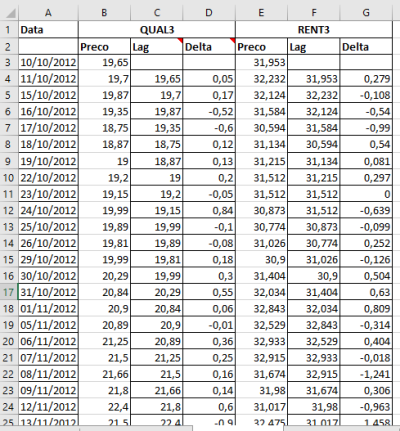

Este notebook tem o objetivo de reproduzir o passo-a-passo para detectar e avaliar pares de ativos [cointegrados](https://en.wikipedia.org/wiki/Cointegration) mostrado no [blog do Dr. Nickel](https://drnickel.wordpress.com/2015/04/03/long-short-atraves-de-cointegracao-parte-3/). 

No poste ele faz faz uma análise dos ativos QUAL3 e RENT3 usando uma [planilha excel](https://drnickel.files.wordpress.com/2015/04/exemplos-cointegracao-qual3_rent32.xlsx), neste notebook refaço o procedimento usando R.

## Dataset

Para garantir que os resultados batam, vamos usar os mesmos dados usado na planilha.




```r
# datahandlers
library(tidyverse)
library(lubridate)

# loading data
library(xlsx)
xls <- read.xlsx("./exemplos-cointegracao-qual3_rent32.xlsx",2) 

# the dataset read is a mess
glimpse(xls)
```

```
## Observations: 505
## Variables: 12
## $ Data  <date> NA, 2012-10-10, 2012-10-11, 2012-10-15, 2012-10-16, 201...
## $ QUAL3 <fct> Preco, 19.65, 19.7, 19.87, 19.35, 18.75, 18.87, 19, 19.2...
## $ NA.   <fct> Lag, NA, 19.65, 19.7, 19.87, 19.35, 18.75, 18.87, 19, 19...
## $ NA..1 <fct> Delta, NA, 0.0500000000000007, 0.170000000000002, -0.52,...
## $ RENT3 <fct> Preco, 31.953, 32.232, 32.124, 31.584, 30.594, 31.134, 3...
## $ NA..2 <fct> Lag, NA, 31.953, 32.232, 32.124, 31.584, 30.594, 31.134,...
## $ NA..3 <fct> Delta, NA, 0.279, -0.107999999999997, -0.540000000000003...
## $ NA..4 <fct> AVISO: Esta planilha é para fins exclusivamente educaci...
## $ NA..5 <lgl> NA, NA, NA, NA, NA, NA, NA, NA, NA, NA, NA, NA, NA, NA, ...
## $ NA..6 <lgl> NA, NA, NA, NA, NA, NA, NA, NA, NA, NA, NA, NA, NA, NA, ...
## $ NA..7 <lgl> NA, NA, NA, NA, NA, NA, NA, NA, NA, NA, NA, NA, NA, NA, ...
## $ NA..8 <lgl> NA, NA, NA, NA, NA, NA, NA, NA, NA, NA, NA, NA, NA, NA, ...
```

Vamos ajustar (tidying) o dataset para deixar como uma tabela: ticker, data, valor.


```r
# cleaning up (tidying)
# separa os dados da QUAL3
xls %>% 
  as.tibble() %>% 
  select( ref.date = Data, price.close=QUAL3 ) %>% 
  filter( complete.cases(.) ) %>% 
  mutate( ticker="QUAL3.SA",
          price.close = as.numeric(as.character(price.close)) ) -> qual


# separa os dados da RENT3
xls %>% 
  as.tibble() %>% 
  select( ref.date = Data, price.close=RENT3 ) %>% 
  filter( complete.cases(.) ) %>% 
  mutate( ticker="RENT3.SA",
          price.close = as.numeric(as.character(price.close)) ) -> rent

# bind them
df.tickers = bind_rows(qual,rent)

# much better
library(knitr)
library(kableExtra)
df.tickers %>% 
  arrange(ref.date) %>% 
  head(10) %>% 
  kable() %>%
  kable_styling(bootstrap_options = "striped", full_width = F)
```

<table class="table table-striped" style="width: auto !important; margin-left: auto; margin-right: auto;">
 <thead>
  <tr>
   <th style="text-align:left;"> ref.date </th>
   <th style="text-align:right;"> price.close </th>
   <th style="text-align:left;"> ticker </th>
  </tr>
 </thead>
<tbody>
  <tr>
   <td style="text-align:left;"> 2012-10-10 </td>
   <td style="text-align:right;"> 19.650 </td>
   <td style="text-align:left;"> QUAL3.SA </td>
  </tr>
  <tr>
   <td style="text-align:left;"> 2012-10-10 </td>
   <td style="text-align:right;"> 31.953 </td>
   <td style="text-align:left;"> RENT3.SA </td>
  </tr>
  <tr>
   <td style="text-align:left;"> 2012-10-11 </td>
   <td style="text-align:right;"> 19.700 </td>
   <td style="text-align:left;"> QUAL3.SA </td>
  </tr>
  <tr>
   <td style="text-align:left;"> 2012-10-11 </td>
   <td style="text-align:right;"> 32.232 </td>
   <td style="text-align:left;"> RENT3.SA </td>
  </tr>
  <tr>
   <td style="text-align:left;"> 2012-10-15 </td>
   <td style="text-align:right;"> 19.870 </td>
   <td style="text-align:left;"> QUAL3.SA </td>
  </tr>
  <tr>
   <td style="text-align:left;"> 2012-10-15 </td>
   <td style="text-align:right;"> 32.124 </td>
   <td style="text-align:left;"> RENT3.SA </td>
  </tr>
  <tr>
   <td style="text-align:left;"> 2012-10-16 </td>
   <td style="text-align:right;"> 19.350 </td>
   <td style="text-align:left;"> QUAL3.SA </td>
  </tr>
  <tr>
   <td style="text-align:left;"> 2012-10-16 </td>
   <td style="text-align:right;"> 31.584 </td>
   <td style="text-align:left;"> RENT3.SA </td>
  </tr>
  <tr>
   <td style="text-align:left;"> 2012-10-17 </td>
   <td style="text-align:right;"> 18.750 </td>
   <td style="text-align:left;"> QUAL3.SA </td>
  </tr>
  <tr>
   <td style="text-align:left;"> 2012-10-17 </td>
   <td style="text-align:right;"> 30.594 </td>
   <td style="text-align:left;"> RENT3.SA </td>
  </tr>
</tbody>
</table>


Com o dataset mais organizado, vamo visualizar os preços dos ativos importados


```r
## plot as line
library(ggplot2)
ggplot(df.tickers,aes(x=ref.date, y=price.close, color=ticker)) +
  geom_line(size=1) + theme_light()
```

<!-- -->

## Séries Não Estacionárias

O próximo passo e avaliar se ambas as séries são não estacionárias, para isso faz-se uma teste de [Dickey-Fuller](https://en.wikipedia.org/wiki/Dickey%E2%80%93Fuller_test):


```r
# fit a LM model with one day delta price
fitLagModel <- function(dtf){

  # pega os datasets de precos de um ticker
  dtf %>% 
    select( price.close ) %>% # so interessa o preco de fechametno
    mutate( price.lag = lag(price.close,1), # cria um "lag" de um dia
            price.delta = price.close - price.lag ) %>%  # delta entre fechamento e lag
    filter( complete.cases(.) ) %>% # elimina valores vazios
    lm( price.lag ~ price.delta, . ) %>% # fita o modelo
    return()
}

## testes de series estacionarias
## para cada ticker fita o modelo linear
## tidyfica alguns parametros do modelo
library(broom)
df.tickers %>%
  group_by(ticker) %>%
  nest() %>% 
  mutate ( lagModel = map(data, fitLagModel),
           lm.coefs  = map(lagModel,tidy),  
           lm.glance = map(lagModel, glance),
           lm.anova  = map(lagModel, anova),
           lm.anova  = map(lm.anova, tidy)) -> stat.test

stat.test 
```

<div data-pagedtable="false">
  <script data-pagedtable-source type="application/json">
{"columns":[{"label":["ticker"],"name":[1],"type":["chr"],"align":["left"]},{"label":["data"],"name":[2],"type":["list"],"align":["right"]},{"label":["lagModel"],"name":[3],"type":["list"],"align":["right"]},{"label":["lm.coefs"],"name":[4],"type":["list"],"align":["right"]},{"label":["lm.glance"],"name":[5],"type":["list"],"align":["right"]},{"label":["lm.anova"],"name":[6],"type":["list"],"align":["right"]}],"data":[{"1":"QUAL3.SA","2":"<tibble>","3":"<S3: lm>","4":"<tibble>","5":"<tibble>","6":"<tibble>"},{"1":"RENT3.SA","2":"<tibble>","3":"<S3: lm>","4":"<tibble>","5":"<tibble>","6":"<tibble>"}],"options":{"columns":{"min":{},"max":[10]},"rows":{"min":[10],"max":[10]},"pages":{}}}
  </script>
</div>

Então para cada um dos ticker, temos um dataset com as cotações, o modelo fitado, dados dos coeficientes, análise de variação e qualidade do fit. Vamos olhar cada uma das séries


```r
stat.test %>% 
  select(ticker, lm.glance) %>% 
  unnest(lm.glance) %>% 
  kable(caption = "Qualidade da regressão") %>%
  kable_styling(bootstrap_options = "striped", full_width = F)
```

<table class="table table-striped" style="width: auto !important; margin-left: auto; margin-right: auto;">
<caption>Qualidade da regressão</caption>
 <thead>
  <tr>
   <th style="text-align:left;"> ticker </th>
   <th style="text-align:right;"> r.squared </th>
   <th style="text-align:right;"> adj.r.squared </th>
   <th style="text-align:right;"> sigma </th>
   <th style="text-align:right;"> statistic </th>
   <th style="text-align:right;"> p.value </th>
   <th style="text-align:right;"> df </th>
   <th style="text-align:right;"> logLik </th>
   <th style="text-align:right;"> AIC </th>
   <th style="text-align:right;"> BIC </th>
   <th style="text-align:right;"> deviance </th>
   <th style="text-align:right;"> df.residual </th>
  </tr>
 </thead>
<tbody>
  <tr>
   <td style="text-align:left;"> QUAL3.SA </td>
   <td style="text-align:right;"> 0.0033114 </td>
   <td style="text-align:right;"> 0.0013220 </td>
   <td style="text-align:right;"> 2.877734 </td>
   <td style="text-align:right;"> 1.664528 </td>
   <td style="text-align:right;"> 0.1975882 </td>
   <td style="text-align:right;"> 2 </td>
   <td style="text-align:right;"> -1244.397 </td>
   <td style="text-align:right;"> 2494.793 </td>
   <td style="text-align:right;"> 2507.455 </td>
   <td style="text-align:right;"> 4148.957 </td>
   <td style="text-align:right;"> 501 </td>
  </tr>
  <tr>
   <td style="text-align:left;"> RENT3.SA </td>
   <td style="text-align:right;"> 0.0069421 </td>
   <td style="text-align:right;"> 0.0049599 </td>
   <td style="text-align:right;"> 2.466154 </td>
   <td style="text-align:right;"> 3.502292 </td>
   <td style="text-align:right;"> 0.0618665 </td>
   <td style="text-align:right;"> 2 </td>
   <td style="text-align:right;"> -1166.762 </td>
   <td style="text-align:right;"> 2339.524 </td>
   <td style="text-align:right;"> 2352.186 </td>
   <td style="text-align:right;"> 3047.041 </td>
   <td style="text-align:right;"> 501 </td>
  </tr>
</tbody>
</table>


```r
stat.test %>% 
  select(ticker, lm.anova) %>% 
  unnest(lm.anova) %>% 
  kable(caption= "Análise de variação") %>%
  kable_styling(bootstrap_options = "striped", full_width = F)
```

<table class="table table-striped" style="width: auto !important; margin-left: auto; margin-right: auto;">
<caption>Análise de variação</caption>
 <thead>
  <tr>
   <th style="text-align:left;"> ticker </th>
   <th style="text-align:left;"> term </th>
   <th style="text-align:right;"> df </th>
   <th style="text-align:right;"> sumsq </th>
   <th style="text-align:right;"> meansq </th>
   <th style="text-align:right;"> statistic </th>
   <th style="text-align:right;"> p.value </th>
  </tr>
 </thead>
<tbody>
  <tr>
   <td style="text-align:left;"> QUAL3.SA </td>
   <td style="text-align:left;"> price.delta </td>
   <td style="text-align:right;"> 1 </td>
   <td style="text-align:right;"> 13.78455 </td>
   <td style="text-align:right;"> 13.784545 </td>
   <td style="text-align:right;"> 1.664528 </td>
   <td style="text-align:right;"> 0.1975882 </td>
  </tr>
  <tr>
   <td style="text-align:left;"> QUAL3.SA </td>
   <td style="text-align:left;"> Residuals </td>
   <td style="text-align:right;"> 501 </td>
   <td style="text-align:right;"> 4148.95749 </td>
   <td style="text-align:right;"> 8.281352 </td>
   <td style="text-align:right;"> NA </td>
   <td style="text-align:right;"> NA </td>
  </tr>
  <tr>
   <td style="text-align:left;"> RENT3.SA </td>
   <td style="text-align:left;"> price.delta </td>
   <td style="text-align:right;"> 1 </td>
   <td style="text-align:right;"> 21.30065 </td>
   <td style="text-align:right;"> 21.300652 </td>
   <td style="text-align:right;"> 3.502292 </td>
   <td style="text-align:right;"> 0.0618665 </td>
  </tr>
  <tr>
   <td style="text-align:left;"> RENT3.SA </td>
   <td style="text-align:left;"> Residuals </td>
   <td style="text-align:right;"> 501 </td>
   <td style="text-align:right;"> 3047.04060 </td>
   <td style="text-align:right;"> 6.081917 </td>
   <td style="text-align:right;"> NA </td>
   <td style="text-align:right;"> NA </td>
  </tr>
</tbody>
</table>


```r
stat.test %>% 
  select(ticker, lm.coefs) %>% 
  unnest(lm.coefs) %>% 
  kable(caption="Coeficientes da regressão") %>%
  kable_styling(bootstrap_options = "striped", full_width = F)
```

<table class="table table-striped" style="width: auto !important; margin-left: auto; margin-right: auto;">
<caption>Coeficientes da regressão</caption>
 <thead>
  <tr>
   <th style="text-align:left;"> ticker </th>
   <th style="text-align:left;"> term </th>
   <th style="text-align:right;"> estimate </th>
   <th style="text-align:right;"> std.error </th>
   <th style="text-align:right;"> statistic </th>
   <th style="text-align:right;"> p.value </th>
  </tr>
 </thead>
<tbody>
  <tr>
   <td style="text-align:left;"> QUAL3.SA </td>
   <td style="text-align:left;"> (Intercept) </td>
   <td style="text-align:right;"> 21.368836 </td>
   <td style="text-align:right;"> 0.1283564 </td>
   <td style="text-align:right;"> 166.480526 </td>
   <td style="text-align:right;"> 0.0000000 </td>
  </tr>
  <tr>
   <td style="text-align:left;"> QUAL3.SA </td>
   <td style="text-align:left;"> price.delta </td>
   <td style="text-align:right;"> -0.447896 </td>
   <td style="text-align:right;"> 0.3471615 </td>
   <td style="text-align:right;"> -1.290166 </td>
   <td style="text-align:right;"> 0.1975882 </td>
  </tr>
  <tr>
   <td style="text-align:left;"> RENT3.SA </td>
   <td style="text-align:left;"> (Intercept) </td>
   <td style="text-align:right;"> 33.074075 </td>
   <td style="text-align:right;"> 0.1099886 </td>
   <td style="text-align:right;"> 300.704459 </td>
   <td style="text-align:right;"> 0.0000000 </td>
  </tr>
  <tr>
   <td style="text-align:left;"> RENT3.SA </td>
   <td style="text-align:left;"> price.delta </td>
   <td style="text-align:right;"> -0.423032 </td>
   <td style="text-align:right;"> 0.2260461 </td>
   <td style="text-align:right;"> -1.871441 </td>
   <td style="text-align:right;"> 0.0618665 </td>
  </tr>
</tbody>
</table>

## Avaliacao de Estacionaridade

Basicamente o teste de Dickey-Fuller pede para avalir se o t-statistics dos coeficentes contrados na regressão então dentro de certos valores em função das amostras utilizadas, seguindo a tabela:


```r
stat.test %>% 
  select(ticker, lm.coefs) %>% 
  unnest(lm.coefs) %>% 
  select(ticker, term, estimate, statistic, p.value) %>%
  filter( term!="(Intercept)" ) %>% 
  select(-term) %>% 
  inner_join( count(df.tickers , ticker), by="ticker") -> coefs

coefs %>% 
  kable(caption="Coeficientes da regressão") %>%
  kable_styling(bootstrap_options = "striped", full_width = F)
```

<table class="table table-striped" style="width: auto !important; margin-left: auto; margin-right: auto;">
<caption>Coeficientes da regressão</caption>
 <thead>
  <tr>
   <th style="text-align:left;"> ticker </th>
   <th style="text-align:right;"> estimate </th>
   <th style="text-align:right;"> statistic </th>
   <th style="text-align:right;"> p.value </th>
   <th style="text-align:right;"> n </th>
  </tr>
 </thead>
<tbody>
  <tr>
   <td style="text-align:left;"> QUAL3.SA </td>
   <td style="text-align:right;"> -0.447896 </td>
   <td style="text-align:right;"> -1.290166 </td>
   <td style="text-align:right;"> 0.1975882 </td>
   <td style="text-align:right;"> 504 </td>
  </tr>
  <tr>
   <td style="text-align:left;"> RENT3.SA </td>
   <td style="text-align:right;"> -0.423032 </td>
   <td style="text-align:right;"> -1.871441 </td>
   <td style="text-align:right;"> 0.0618665 </td>
   <td style="text-align:right;"> 504 </td>
  </tr>
</tbody>
</table>

Para QUAL3 encontramos o valor de **-1.29** e para RENT3 encontramos **-1.871** para ~500 amostras. Ambos os valores estão abaixo (em módulo) dos valores de referência na tabela Dickey-Fuller, mostrando que ambas as séries são "não-estacionárias".

### Testes de Estacionaridade usando outras funções


```r
library(tseries)
# dickey fuller using adf.test
stat.test %>% 
  mutate( adf = map(lagModel, function(m){ adf.test(m$residuals,k=1) }) ) %>% 
  mutate( adf.htest = map(adf,tidy) ) %>% 
  select( ticker, adf.htest ) %>% 
  unnest() %>% 
  select(ticker, statistic, p.value) %>% 
  mutate( hypothesis=ifelse(p.value>=0.05,"non-stationary","stationary")) %>% 
  kable(caption="ADF.TEST - Residuals of each ticker") %>%
  kable_styling(bootstrap_options = "striped", full_width = F)
```

<table class="table table-striped" style="width: auto !important; margin-left: auto; margin-right: auto;">
<caption>ADF.TEST - Residuals of each ticker</caption>
 <thead>
  <tr>
   <th style="text-align:left;"> ticker </th>
   <th style="text-align:right;"> statistic </th>
   <th style="text-align:right;"> p.value </th>
   <th style="text-align:left;"> hypothesis </th>
  </tr>
 </thead>
<tbody>
  <tr>
   <td style="text-align:left;"> QUAL3.SA </td>
   <td style="text-align:right;"> -2.27308 </td>
   <td style="text-align:right;"> 0.4627173 </td>
   <td style="text-align:left;"> non-stationary </td>
  </tr>
  <tr>
   <td style="text-align:left;"> RENT3.SA </td>
   <td style="text-align:right;"> -2.93526 </td>
   <td style="text-align:right;"> 0.1824295 </td>
   <td style="text-align:left;"> non-stationary </td>
  </tr>
</tbody>
</table>

```r
df.tickers %>% 
  arrange(ref.date) %>%
  filter(complete.cases(.)) %>%
  group_by(ticker) %>% 
  nest() %>% 
  mutate(adf=map(data, function(df){
    df %>% 
      pull(price.close) %>% 
      adf.test() %>% 
      tidy() %>% 
      select(statistic, p.value) %>%
      mutate( hypothesis=ifelse(p.value>=0.05,"non-stationary","stationary"))  
  })) %>% 
  select(ticker,adf) %>% 
  unnest() %>% 
  kable(caption="ADF.TEST - On each ticker price.close") %>%
  kable_styling(bootstrap_options = "striped", full_width = F)
```

<table class="table table-striped" style="width: auto !important; margin-left: auto; margin-right: auto;">
<caption>ADF.TEST - On each ticker price.close</caption>
 <thead>
  <tr>
   <th style="text-align:left;"> ticker </th>
   <th style="text-align:right;"> statistic </th>
   <th style="text-align:right;"> p.value </th>
   <th style="text-align:left;"> hypothesis </th>
  </tr>
 </thead>
<tbody>
  <tr>
   <td style="text-align:left;"> QUAL3.SA </td>
   <td style="text-align:right;"> -1.658701 </td>
   <td style="text-align:right;"> 0.7227721 </td>
   <td style="text-align:left;"> non-stationary </td>
  </tr>
  <tr>
   <td style="text-align:left;"> RENT3.SA </td>
   <td style="text-align:right;"> -2.272914 </td>
   <td style="text-align:right;"> 0.4627875 </td>
   <td style="text-align:left;"> non-stationary </td>
  </tr>
</tbody>
</table>

## Cointegração QUAL3 ~ RENT3

Como as duas séries são não estacionárias, elas estarão cointegradas se uma combinação linear entre as duas apresentar um comportamento estacionário. Para tal, faze-se uma composição de ativos e então aplica-se o teste Dickey-Fuller nos resíduos a vim de (neste momento) verificar a estacionaridade.


```r
# faz a composicao para detectar a cointegração
# fitando um modelo de um ativo contra outro
df.tickers %>% 
  spread(key=ticker, value=price.close) %>%
  lm(QUAL3.SA ~ RENT3.SA, .) -> coint

# avalia valores obtidos no modelo
coint %>%
  glance() %>% 
  kable(caption = "Qualidade da regressão") %>%
  kable_styling(bootstrap_options = "striped", full_width = F)
```

<table class="table table-striped" style="width: auto !important; margin-left: auto; margin-right: auto;">
<caption>Qualidade da regressão</caption>
 <thead>
  <tr>
   <th style="text-align:left;">   </th>
   <th style="text-align:right;"> r.squared </th>
   <th style="text-align:right;"> adj.r.squared </th>
   <th style="text-align:right;"> sigma </th>
   <th style="text-align:right;"> statistic </th>
   <th style="text-align:right;"> p.value </th>
   <th style="text-align:right;"> df </th>
   <th style="text-align:right;"> logLik </th>
   <th style="text-align:right;"> AIC </th>
   <th style="text-align:right;"> BIC </th>
   <th style="text-align:right;"> deviance </th>
   <th style="text-align:right;"> df.residual </th>
  </tr>
 </thead>
<tbody>
  <tr>
   <td style="text-align:left;"> value </td>
   <td style="text-align:right;"> 0.7743701 </td>
   <td style="text-align:right;"> 0.7739206 </td>
   <td style="text-align:right;"> 1.369506 </td>
   <td style="text-align:right;"> 1722.882 </td>
   <td style="text-align:right;"> 0 </td>
   <td style="text-align:right;"> 2 </td>
   <td style="text-align:right;"> -872.6258 </td>
   <td style="text-align:right;"> 1751.252 </td>
   <td style="text-align:right;"> 1763.919 </td>
   <td style="text-align:right;"> 941.5243 </td>
   <td style="text-align:right;"> 502 </td>
  </tr>
</tbody>
</table>


```r
coint %>%
  anova() %>%
  tidy() %>%  
  kable(caption = "Análise de Variacao") %>%
  kable_styling(bootstrap_options = "striped", full_width = F)
```

<table class="table table-striped" style="width: auto !important; margin-left: auto; margin-right: auto;">
<caption>Análise de Variacao</caption>
 <thead>
  <tr>
   <th style="text-align:left;"> term </th>
   <th style="text-align:right;"> df </th>
   <th style="text-align:right;"> sumsq </th>
   <th style="text-align:right;"> meansq </th>
   <th style="text-align:right;"> statistic </th>
   <th style="text-align:right;"> p.value </th>
  </tr>
 </thead>
<tbody>
  <tr>
   <td style="text-align:left;"> RENT3.SA </td>
   <td style="text-align:right;"> 1 </td>
   <td style="text-align:right;"> 3231.3452 </td>
   <td style="text-align:right;"> 3231.345212 </td>
   <td style="text-align:right;"> 1722.882 </td>
   <td style="text-align:right;"> 0 </td>
  </tr>
  <tr>
   <td style="text-align:left;"> Residuals </td>
   <td style="text-align:right;"> 502 </td>
   <td style="text-align:right;"> 941.5243 </td>
   <td style="text-align:right;"> 1.875546 </td>
   <td style="text-align:right;"> NA </td>
   <td style="text-align:right;"> NA </td>
  </tr>
</tbody>
</table>


```r
coint %>% 
  tidy() %>%  
  kable(caption = "Coeficientes da Regressao") %>%
  kable_styling(bootstrap_options = "striped", full_width = F)
```

<table class="table table-striped" style="width: auto !important; margin-left: auto; margin-right: auto;">
<caption>Coeficientes da Regressao</caption>
 <thead>
  <tr>
   <th style="text-align:left;"> term </th>
   <th style="text-align:right;"> estimate </th>
   <th style="text-align:right;"> std.error </th>
   <th style="text-align:right;"> statistic </th>
   <th style="text-align:right;"> p.value </th>
  </tr>
 </thead>
<tbody>
  <tr>
   <td style="text-align:left;"> (Intercept) </td>
   <td style="text-align:right;"> -12.466815 </td>
   <td style="text-align:right;"> 0.8174937 </td>
   <td style="text-align:right;"> -15.25004 </td>
   <td style="text-align:right;"> 0 </td>
  </tr>
  <tr>
   <td style="text-align:left;"> RENT3.SA </td>
   <td style="text-align:right;"> 1.022958 </td>
   <td style="text-align:right;"> 0.0246451 </td>
   <td style="text-align:right;"> 41.50761 </td>
   <td style="text-align:right;"> 0 </td>
  </tr>
</tbody>
</table>
  


```r
# monta um dataset para avaliar os residuos
df.tickers %>%
  filter( ticker=="QUAL3.SA" ) %>% 
  select(ticker, ref.date, price.close) %>% 
  bind_cols(
    tibble(
      predicted = coint$fitted.values,
      residuals = coint$residuals
    )    
  ) %>% 
  mutate( lagRes = lag(residuals,1),
          deltaRes = residuals - lagRes ) -> coint.ds

coint.ds %>% 
  head(10) %>% 
  kable(caption = "Preparacao dos Resíduos para fazer teste Dickey-Fuller") %>%
  kable_styling(bootstrap_options = "striped", full_width = F)
```

<table class="table table-striped" style="width: auto !important; margin-left: auto; margin-right: auto;">
<caption>Preparacao dos Resíduos para fazer teste Dickey-Fuller</caption>
 <thead>
  <tr>
   <th style="text-align:left;"> ticker </th>
   <th style="text-align:left;"> ref.date </th>
   <th style="text-align:right;"> price.close </th>
   <th style="text-align:right;"> predicted </th>
   <th style="text-align:right;"> residuals </th>
   <th style="text-align:right;"> lagRes </th>
   <th style="text-align:right;"> deltaRes </th>
  </tr>
 </thead>
<tbody>
  <tr>
   <td style="text-align:left;"> QUAL3.SA </td>
   <td style="text-align:left;"> 2012-10-10 </td>
   <td style="text-align:right;"> 19.65 </td>
   <td style="text-align:right;"> 20.21976 </td>
   <td style="text-align:right;"> -0.5697610 </td>
   <td style="text-align:right;"> NA </td>
   <td style="text-align:right;"> NA </td>
  </tr>
  <tr>
   <td style="text-align:left;"> QUAL3.SA </td>
   <td style="text-align:left;"> 2012-10-11 </td>
   <td style="text-align:right;"> 19.70 </td>
   <td style="text-align:right;"> 20.50517 </td>
   <td style="text-align:right;"> -0.8051662 </td>
   <td style="text-align:right;"> -0.5697610 </td>
   <td style="text-align:right;"> -0.2354053 </td>
  </tr>
  <tr>
   <td style="text-align:left;"> QUAL3.SA </td>
   <td style="text-align:left;"> 2012-10-15 </td>
   <td style="text-align:right;"> 19.87 </td>
   <td style="text-align:right;"> 20.39469 </td>
   <td style="text-align:right;"> -0.5246868 </td>
   <td style="text-align:right;"> -0.8051662 </td>
   <td style="text-align:right;"> 0.2804795 </td>
  </tr>
  <tr>
   <td style="text-align:left;"> QUAL3.SA </td>
   <td style="text-align:left;"> 2012-10-16 </td>
   <td style="text-align:right;"> 19.35 </td>
   <td style="text-align:right;"> 19.84229 </td>
   <td style="text-align:right;"> -0.4922895 </td>
   <td style="text-align:right;"> -0.5246868 </td>
   <td style="text-align:right;"> 0.0323973 </td>
  </tr>
  <tr>
   <td style="text-align:left;"> QUAL3.SA </td>
   <td style="text-align:left;"> 2012-10-17 </td>
   <td style="text-align:right;"> 18.75 </td>
   <td style="text-align:right;"> 18.82956 </td>
   <td style="text-align:right;"> -0.0795611 </td>
   <td style="text-align:right;"> -0.4922895 </td>
   <td style="text-align:right;"> 0.4127284 </td>
  </tr>
  <tr>
   <td style="text-align:left;"> QUAL3.SA </td>
   <td style="text-align:left;"> 2012-10-18 </td>
   <td style="text-align:right;"> 18.87 </td>
   <td style="text-align:right;"> 19.38196 </td>
   <td style="text-align:right;"> -0.5119584 </td>
   <td style="text-align:right;"> -0.0795611 </td>
   <td style="text-align:right;"> -0.4323973 </td>
  </tr>
  <tr>
   <td style="text-align:left;"> QUAL3.SA </td>
   <td style="text-align:left;"> 2012-10-19 </td>
   <td style="text-align:right;"> 19.00 </td>
   <td style="text-align:right;"> 19.46482 </td>
   <td style="text-align:right;"> -0.4648180 </td>
   <td style="text-align:right;"> -0.5119584 </td>
   <td style="text-align:right;"> 0.0471404 </td>
  </tr>
  <tr>
   <td style="text-align:left;"> QUAL3.SA </td>
   <td style="text-align:left;"> 2012-10-22 </td>
   <td style="text-align:right;"> 19.20 </td>
   <td style="text-align:right;"> 19.76864 </td>
   <td style="text-align:right;"> -0.5686365 </td>
   <td style="text-align:right;"> -0.4648180 </td>
   <td style="text-align:right;"> -0.1038185 </td>
  </tr>
  <tr>
   <td style="text-align:left;"> QUAL3.SA </td>
   <td style="text-align:left;"> 2012-10-23 </td>
   <td style="text-align:right;"> 19.15 </td>
   <td style="text-align:right;"> 19.76864 </td>
   <td style="text-align:right;"> -0.6186365 </td>
   <td style="text-align:right;"> -0.5686365 </td>
   <td style="text-align:right;"> -0.0500000 </td>
  </tr>
  <tr>
   <td style="text-align:left;"> QUAL3.SA </td>
   <td style="text-align:left;"> 2012-10-24 </td>
   <td style="text-align:right;"> 19.99 </td>
   <td style="text-align:right;"> 19.11497 </td>
   <td style="text-align:right;"> 0.8750336 </td>
   <td style="text-align:right;"> -0.6186365 </td>
   <td style="text-align:right;"> 1.4936701 </td>
  </tr>
</tbody>
</table>


```r
# fit dos residuos
coint.ds %>% 
  lm(lagRes ~ deltaRes, .) -> coint.lm
```


```r
# avalia valores obtidos no modelo
coint.lm %>%
  glance() %>% 
  kable(caption = "Qualidade da regressão") %>%
  kable_styling(bootstrap_options = "striped", full_width = F)
```

<table class="table table-striped" style="width: auto !important; margin-left: auto; margin-right: auto;">
<caption>Qualidade da regressão</caption>
 <thead>
  <tr>
   <th style="text-align:left;">   </th>
   <th style="text-align:right;"> r.squared </th>
   <th style="text-align:right;"> adj.r.squared </th>
   <th style="text-align:right;"> sigma </th>
   <th style="text-align:right;"> statistic </th>
   <th style="text-align:right;"> p.value </th>
   <th style="text-align:right;"> df </th>
   <th style="text-align:right;"> logLik </th>
   <th style="text-align:right;"> AIC </th>
   <th style="text-align:right;"> BIC </th>
   <th style="text-align:right;"> deviance </th>
   <th style="text-align:right;"> df.residual </th>
  </tr>
 </thead>
<tbody>
  <tr>
   <td style="text-align:left;"> value </td>
   <td style="text-align:right;"> 0.0405699 </td>
   <td style="text-align:right;"> 0.0386549 </td>
   <td style="text-align:right;"> 1.341484 </td>
   <td style="text-align:right;"> 21.18501 </td>
   <td style="text-align:right;"> 5.3e-06 </td>
   <td style="text-align:right;"> 2 </td>
   <td style="text-align:right;"> -860.4938 </td>
   <td style="text-align:right;"> 1726.988 </td>
   <td style="text-align:right;"> 1739.649 </td>
   <td style="text-align:right;"> 901.5899 </td>
   <td style="text-align:right;"> 501 </td>
  </tr>
</tbody>
</table>


```r
coint.lm %>%
  anova() %>%
  tidy() %>%  
  kable(caption = "Análise de Variacao") %>%
  kable_styling(bootstrap_options = "striped", full_width = F)
```

<table class="table table-striped" style="width: auto !important; margin-left: auto; margin-right: auto;">
<caption>Análise de Variacao</caption>
 <thead>
  <tr>
   <th style="text-align:left;"> term </th>
   <th style="text-align:right;"> df </th>
   <th style="text-align:right;"> sumsq </th>
   <th style="text-align:right;"> meansq </th>
   <th style="text-align:right;"> statistic </th>
   <th style="text-align:right;"> p.value </th>
  </tr>
 </thead>
<tbody>
  <tr>
   <td style="text-align:left;"> deltaRes </td>
   <td style="text-align:right;"> 1 </td>
   <td style="text-align:right;"> 38.12413 </td>
   <td style="text-align:right;"> 38.124130 </td>
   <td style="text-align:right;"> 21.18501 </td>
   <td style="text-align:right;"> 5.3e-06 </td>
  </tr>
  <tr>
   <td style="text-align:left;"> Residuals </td>
   <td style="text-align:right;"> 501 </td>
   <td style="text-align:right;"> 901.58992 </td>
   <td style="text-align:right;"> 1.799581 </td>
   <td style="text-align:right;"> NA </td>
   <td style="text-align:right;"> NA </td>
  </tr>
</tbody>
</table>


```r
coint.lm %>% 
  tidy() %>%  
  kable(caption = "Coeficientes da Regressao") %>%
  kable_styling(bootstrap_options = "striped", full_width = F)
```

<table class="table table-striped" style="width: auto !important; margin-left: auto; margin-right: auto;">
<caption>Coeficientes da Regressao</caption>
 <thead>
  <tr>
   <th style="text-align:left;"> term </th>
   <th style="text-align:right;"> estimate </th>
   <th style="text-align:right;"> std.error </th>
   <th style="text-align:right;"> statistic </th>
   <th style="text-align:right;"> p.value </th>
  </tr>
 </thead>
<tbody>
  <tr>
   <td style="text-align:left;"> (Intercept) </td>
   <td style="text-align:right;"> 0.0019098 </td>
   <td style="text-align:right;"> 0.0598141 </td>
   <td style="text-align:right;"> 0.0319291 </td>
   <td style="text-align:right;"> 0.9745413 </td>
  </tr>
  <tr>
   <td style="text-align:left;"> deltaRes </td>
   <td style="text-align:right;"> -0.4952238 </td>
   <td style="text-align:right;"> 0.1075938 </td>
   <td style="text-align:right;"> -4.6027174 </td>
   <td style="text-align:right;"> 0.0000053 </td>
  </tr>
</tbody>
</table>

```r
tstat <- coint.lm %>% tidy %>% filter(term=="deltaRes") %>% pull(statistic)
```

Desta vez, o t-stat obtido foi de **-4.603**, muito além (em módulo) dos valores para a tabela de significância para 500 ou mais amostras. Neste confirmando que a hipótese de que a série é estacionária, e portanto os pares estão cointegrados.


```r
# dickey fuller using adf.test
coint.lm$residuals %>% 
  adf.test(k=1) %>% 
  tidy() %>% 
  select(statistic, p.value) %>% 
  mutate( hypothesis=ifelse(p.value>=0.05,"(Ha): Non-Stationary","(H0): Stationary")) %>% 
  kable(caption="ADF.TEST - Residuals of Cointegration") %>%
  kable_styling(bootstrap_options = "striped", full_width = F)
```

<table class="table table-striped" style="width: auto !important; margin-left: auto; margin-right: auto;">
<caption>ADF.TEST - Residuals of Cointegration</caption>
 <thead>
  <tr>
   <th style="text-align:right;"> statistic </th>
   <th style="text-align:right;"> p.value </th>
   <th style="text-align:left;"> hypothesis </th>
  </tr>
 </thead>
<tbody>
  <tr>
   <td style="text-align:right;"> -5.191728 </td>
   <td style="text-align:right;"> 0.01 </td>
   <td style="text-align:left;"> (H0): Stationary </td>
  </tr>
</tbody>
</table>

```r
# dickey fuller using adf.test on compisition
coint.lm$fitted.values %>% 
  adf.test(k=1) %>% 
  tidy() %>% 
  select(statistic, p.value) %>% 
  mutate( hypothesis=ifelse(p.value>=0.05,"(Ha): Non-Stationary","(H0): Stationary")) %>% 
  kable(caption="ADF.TEST - Composition of Cointegration Pair") %>%
  kable_styling(bootstrap_options = "striped", full_width = F)
```

<table class="table table-striped" style="width: auto !important; margin-left: auto; margin-right: auto;">
<caption>ADF.TEST - Composition of Cointegration Pair</caption>
 <thead>
  <tr>
   <th style="text-align:right;"> statistic </th>
   <th style="text-align:right;"> p.value </th>
   <th style="text-align:left;"> hypothesis </th>
  </tr>
 </thead>
<tbody>
  <tr>
   <td style="text-align:right;"> -17.41442 </td>
   <td style="text-align:right;"> 0.01 </td>
   <td style="text-align:left;"> (H0): Stationary </td>
  </tr>
</tbody>
</table>


### Spread

O spread entre os ativos pode ser visualizado pelos resíduos da combinação linear:


```r
# plot

# banda +/- 2 SD
sd.res <- sd(coint.ds$residuals)

# residuos e banda
coint.ds %>% 
  ggplot(aes(x=ref.date, y=residuals)) + 
  geom_line(color="blue",size=1) +
  geom_hline(yintercept =  2*sd.res, color="red", linetype=2) +
  geom_hline(yintercept = -2*sd.res, color="red", linetype=2) +
  theme_light()
```

<!-- -->

## Trading

O gráfico acima apresenta a evolução do spread ao longo do tempo, com duas bandas representando -2 e 2 vezes o desvio padrão dos resíduos. Vemos que, apesar de os resíduos apresentarem certa persistência, comportam-se de maneira aparentemente desejável: flutuam razoavelmente ao redor da média, visitando-a com certa frequência. Uma regra possível de operação consistiria em vender o par quando o resíduo estiver acima da banda, e comprar o par quando estiver abaixo da banda. O trade pode ser encerrado quando o par voltar a média ou a um percentual qualquer da média.

### Detectando Operações

Seguindo a estratégia acima, usamos as transições de banda e pela média para detectar os pontos de entrada e saída de operações long e short.


```r
startPar <- 2*sd.res
closePar <- 0

coint.ds %>% 
  mutate(operation=case_when(
    lagRes < startPar & residuals >= startPar   ~ "short_start",
    lagRes > closePar & residuals <= closePar    ~ "short_stop"
  )) %>%
  filter( !is.na(operation) ) %>% 
  mutate( operation.lag = lag(operation,1) ) %>% 
  select( ref.date, residuals, lagRes, operation, operation.lag ) %>% 
  filter( operation!=operation.lag ) %>% 
  select( -operation.lag) -> ops.short


coint.ds %>% 
  mutate(operation=case_when(
    lagRes > -startPar & residuals <= -startPar ~ "long_start",
    lagRes < -closePar & residuals >= -closePar ~ "long_stop"
  )) %>%
  filter( !is.na(operation) ) %>% 
  mutate( operation.lag = lag(operation,1) ) %>% 
  select( ref.date, residuals, lagRes, operation, operation.lag ) %>% 
  filter( operation!=operation.lag ) %>% 
  select( -operation.lag) -> ops.long

operations <- bind_rows(ops.short, ops.long)


# residuos e banda
coint.ds %>% 
  ggplot(aes(x=ref.date, y=residuals)) + 
  geom_line(color="blue",size=1, alpha=0.5) +
  geom_hline(yintercept =  startPar, color="red", linetype=2) +
  geom_hline(yintercept =  closePar, color="blue", linetype=2) +
  geom_hline(yintercept = -closePar, color="blue", linetype=2) +
  geom_hline(yintercept = -startPar, color="red", linetype=2) +
  geom_vline(data=operations, 
             mapping=aes(xintercept = ref.date, color=operation),
             size=1, linetype=1) +
  theme_light()
```

<!-- -->

### Tabela de operações


```r
operations %>% 
  arrange(ref.date) %>% 
  mutate( opLag = lead(operation, 1),
          open=ref.date,
          close = lead(ref.date,1) ) %>% 
  filter( (operation=="short_start" & opLag=="short_stop") |
          (operation=="long_start" & opLag=="long_stop") ) %>% 
  select(-ref.date, -residuals, -lagRes, -opLag) %>% 
  mutate( operation=case_when(
    operation=="short_start" ~ "short",
    operation=="long_start"  ~ "long"
  ) ) %>% 
  mutate( life.span = round(lubridate::interval(open, close)/days(1)) )-> operations

operations %>%  
  kable(caption = "Operacoes Cointegradas") %>%
  kable_styling(bootstrap_options = "striped", full_width = F)
```

<table class="table table-striped" style="width: auto !important; margin-left: auto; margin-right: auto;">
<caption>Operacoes Cointegradas</caption>
 <thead>
  <tr>
   <th style="text-align:left;"> operation </th>
   <th style="text-align:left;"> open </th>
   <th style="text-align:left;"> close </th>
   <th style="text-align:right;"> life.span </th>
  </tr>
 </thead>
<tbody>
  <tr>
   <td style="text-align:left;"> short </td>
   <td style="text-align:left;"> 2012-11-12 </td>
   <td style="text-align:left;"> 2012-11-29 </td>
   <td style="text-align:right;"> 17 </td>
  </tr>
  <tr>
   <td style="text-align:left;"> long </td>
   <td style="text-align:left;"> 2013-02-13 </td>
   <td style="text-align:left;"> 2013-02-20 </td>
   <td style="text-align:right;"> 7 </td>
  </tr>
  <tr>
   <td style="text-align:left;"> long </td>
   <td style="text-align:left;"> 2013-07-11 </td>
   <td style="text-align:left;"> 2013-08-20 </td>
   <td style="text-align:right;"> 40 </td>
  </tr>
  <tr>
   <td style="text-align:left;"> short </td>
   <td style="text-align:left;"> 2014-02-04 </td>
   <td style="text-align:left;"> 2014-02-18 </td>
   <td style="text-align:right;"> 14 </td>
  </tr>
  <tr>
   <td style="text-align:left;"> short </td>
   <td style="text-align:left;"> 2014-03-07 </td>
   <td style="text-align:left;"> 2014-04-22 </td>
   <td style="text-align:right;"> 46 </td>
  </tr>
</tbody>
</table>
Com a tabela de operações, podemos simular os ganhos de operação, lembrando que quando o par é vendido abre-se simultaneamente uma posição vendida na primeira ação e comprada na segunda ação e a operação oposta é realizada quando o par é comprado.

Neste sentido vamos recuperar os valores da cotação de QUAL3 e RENT3 nas datas de abertura e fechamento de operações.


```r
operations %>%
  select( open ) %>% 
  inner_join(df.tickers, by=c("open"="ref.date")) %>% 
  spread(key = ticker, value=price.close) %>% 
  set_names(c("open","QUAL3.SA.OPEN","RENT3.SA.OPEN")) -> prices.open

operations %>%
  select( close ) %>% 
  inner_join(df.tickers, by=c("close"="ref.date")) %>% 
  spread(key = ticker, value=price.close) %>% 
  set_names(c("close","QUAL3.SA.CLOSE","RENT3.SA.CLOSE")) -> prices.close

operations %>%
  inner_join(prices.open, by="open") %>% 
  inner_join(prices.close, by="close") -> op.results

op.results %>% 
  kable(caption = "Cotações do par integrado") %>%
  kable_styling(bootstrap_options = "striped", full_width = F)
```

<table class="table table-striped" style="width: auto !important; margin-left: auto; margin-right: auto;">
<caption>Cotações do par integrado</caption>
 <thead>
  <tr>
   <th style="text-align:left;"> operation </th>
   <th style="text-align:left;"> open </th>
   <th style="text-align:left;"> close </th>
   <th style="text-align:right;"> life.span </th>
   <th style="text-align:right;"> QUAL3.SA.OPEN </th>
   <th style="text-align:right;"> RENT3.SA.OPEN </th>
   <th style="text-align:right;"> QUAL3.SA.CLOSE </th>
   <th style="text-align:right;"> RENT3.SA.CLOSE </th>
  </tr>
 </thead>
<tbody>
  <tr>
   <td style="text-align:left;"> short </td>
   <td style="text-align:left;"> 2012-11-12 </td>
   <td style="text-align:left;"> 2012-11-29 </td>
   <td style="text-align:right;"> 17 </td>
   <td style="text-align:right;"> 22.40 </td>
   <td style="text-align:right;"> 31.017 </td>
   <td style="text-align:right;"> 19.99 </td>
   <td style="text-align:right;"> 32.511 </td>
  </tr>
  <tr>
   <td style="text-align:left;"> long </td>
   <td style="text-align:left;"> 2013-02-13 </td>
   <td style="text-align:left;"> 2013-02-20 </td>
   <td style="text-align:right;"> 7 </td>
   <td style="text-align:right;"> 19.50 </td>
   <td style="text-align:right;"> 34.582 </td>
   <td style="text-align:right;"> 21.50 </td>
   <td style="text-align:right;"> 32.914 </td>
  </tr>
  <tr>
   <td style="text-align:left;"> long </td>
   <td style="text-align:left;"> 2013-07-11 </td>
   <td style="text-align:left;"> 2013-08-20 </td>
   <td style="text-align:right;"> 40 </td>
   <td style="text-align:right;"> 15.03 </td>
   <td style="text-align:right;"> 30.311 </td>
   <td style="text-align:right;"> 17.37 </td>
   <td style="text-align:right;"> 29.026 </td>
  </tr>
  <tr>
   <td style="text-align:left;"> short </td>
   <td style="text-align:left;"> 2014-02-04 </td>
   <td style="text-align:left;"> 2014-02-18 </td>
   <td style="text-align:right;"> 14 </td>
   <td style="text-align:right;"> 21.00 </td>
   <td style="text-align:right;"> 29.657 </td>
   <td style="text-align:right;"> 19.60 </td>
   <td style="text-align:right;"> 31.387 </td>
  </tr>
  <tr>
   <td style="text-align:left;"> short </td>
   <td style="text-align:left;"> 2014-03-07 </td>
   <td style="text-align:left;"> 2014-04-22 </td>
   <td style="text-align:right;"> 46 </td>
   <td style="text-align:right;"> 20.85 </td>
   <td style="text-align:right;"> 29.806 </td>
   <td style="text-align:right;"> 22.47 </td>
   <td style="text-align:right;"> 34.571 </td>
  </tr>
</tbody>
</table>

Com as cotações na mão vamos simular uma operação cointegrada com cash neutro, ou seja, o volume financeiro comprado é o mesmo valor vendido.

### plot das operacoes


```r
ggplot() +
  geom_line(data=df.tickers, 
            aes(x=ref.date, y=price.close, color=ticker),size=1) +
  geom_rect(data=op.results,
            aes(xmin=open, ymin=QUAL3.SA.OPEN,
                xmax=close, ymax=QUAL3.SA.CLOSE,
                fill=ifelse(QUAL3.SA.OPEN<QUAL3.SA.CLOSE,"green","purple")),
                alpha=0.35, show.legend = F) +
    geom_rect(data=op.results,
            aes(xmin=open, ymin=RENT3.SA.OPEN,
                xmax=close, ymax=RENT3.SA.CLOSE,
                fill=ifelse(RENT3.SA.OPEN<RENT3.SA.CLOSE,"green","purple")),
                alpha=0.35, show.legend = F) +
  theme_light() 
```

<!-- -->


```r
op.results %>% 
  mutate( vol.qual3 = round(1000/QUAL3.SA.OPEN),
          vol.rent3 = round(1000/RENT3.SA.OPEN) ) %>% 
  mutate( entrada = case_when(
    operation == "short" ~ round(vol.qual3*QUAL3.SA.OPEN-vol.rent3*RENT3.SA.OPEN,2),
    operation == "long"  ~ round(vol.rent3*RENT3.SA.OPEN-vol.qual3*QUAL3.SA.OPEN,2)
  )) %>% 
  mutate( saida = case_when(
    operation == "short" ~ round(vol.rent3*RENT3.SA.CLOSE-vol.qual3*QUAL3.SA.CLOSE,2),
    operation == "long"  ~ round(vol.qual3*QUAL3.SA.CLOSE-vol.rent3*RENT3.SA.CLOSE,2)
  )) %>% 
  mutate(
    retorno = (saida-entrada)/2000
  ) -> results

results %>% 
  select(operation, open, close, entrada, saida, retorno) %>% 
  kable(caption = "Retorno obtido") %>%
  kable_styling(bootstrap_options = "striped", full_width = F)
```

<table class="table table-striped" style="width: auto !important; margin-left: auto; margin-right: auto;">
<caption>Retorno obtido</caption>
 <thead>
  <tr>
   <th style="text-align:left;"> operation </th>
   <th style="text-align:left;"> open </th>
   <th style="text-align:left;"> close </th>
   <th style="text-align:right;"> entrada </th>
   <th style="text-align:right;"> saida </th>
   <th style="text-align:right;"> retorno </th>
  </tr>
 </thead>
<tbody>
  <tr>
   <td style="text-align:left;"> short </td>
   <td style="text-align:left;"> 2012-11-12 </td>
   <td style="text-align:left;"> 2012-11-29 </td>
   <td style="text-align:right;"> 15.46 </td>
   <td style="text-align:right;"> 140.80 </td>
   <td style="text-align:right;"> 0.062670 </td>
  </tr>
  <tr>
   <td style="text-align:left;"> long </td>
   <td style="text-align:left;"> 2013-02-13 </td>
   <td style="text-align:left;"> 2013-02-20 </td>
   <td style="text-align:right;"> 8.38 </td>
   <td style="text-align:right;"> 141.99 </td>
   <td style="text-align:right;"> 0.066805 </td>
  </tr>
  <tr>
   <td style="text-align:left;"> long </td>
   <td style="text-align:left;"> 2013-07-11 </td>
   <td style="text-align:left;"> 2013-08-20 </td>
   <td style="text-align:right;"> -6.75 </td>
   <td style="text-align:right;"> 205.93 </td>
   <td style="text-align:right;"> 0.106340 </td>
  </tr>
  <tr>
   <td style="text-align:left;"> short </td>
   <td style="text-align:left;"> 2014-02-04 </td>
   <td style="text-align:left;"> 2014-02-18 </td>
   <td style="text-align:right;"> -0.34 </td>
   <td style="text-align:right;"> 126.36 </td>
   <td style="text-align:right;"> 0.063350 </td>
  </tr>
  <tr>
   <td style="text-align:left;"> short </td>
   <td style="text-align:left;"> 2014-03-07 </td>
   <td style="text-align:left;"> 2014-04-22 </td>
   <td style="text-align:right;"> -12.60 </td>
   <td style="text-align:right;"> 96.85 </td>
   <td style="text-align:right;"> 0.054725 </td>
  </tr>
</tbody>
</table>


```r
results %>% 
  summarise( saldoEntrada = sum(entrada,na.rm = T),
             saldoSaida   = sum(saida,na.rm = T)) %>% 
  t() %>% 
  kable(caption="Resultado") %>% 
  kable_styling(bootstrap_options = "striped", full_width = F)
```

<table class="table table-striped" style="width: auto !important; margin-left: auto; margin-right: auto;">
<caption>Resultado</caption>
<tbody>
  <tr>
   <td style="text-align:left;"> saldoEntrada </td>
   <td style="text-align:right;"> 4.15 </td>
  </tr>
  <tr>
   <td style="text-align:left;"> saldoSaida </td>
   <td style="text-align:right;"> 711.93 </td>
  </tr>
</tbody>
</table>

